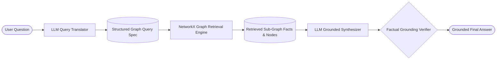

# E-Commerce Knowledge Graph & AI Retrieval Engine

[](https://www.python.org/)
[](https://networkx.org/)
[](https://fastapi.tiangolo.com/)
[]()
[]()

A complete, production-grade Knowledge Graph and AI-powered data retrieval system built in Python for an e-commerce ecosystem. Converts natural language questions into structured graph queries, traverses multi-hop entity relationships, and delivers strictly grounded, hallucination-free answers.

---

## Table of Contents
- [1. Architecture Overview](#1-architecture-overview)
- [2. Knowledge Graph Schema & Entity Relationships](#2-knowledge-graph-schema--entity-relationships)
- [3. The Exactly 5-Banana Requirement](#3-the-exactly-5-banana-requirement)
- [4. Retrieval Layer & LLM Integration Flow](#4-retrieval-layer--llm-integration-flow)
- [5. How Factual Grounding is Enforced](#5-how-factual-grounding-is-enforced)
- [6. Setup and Execution Instructions](#6-setup-and-execution-instructions)
- [7. Benchmark Sample Questions & Results](#7-benchmark-sample-questions--results)
- [8. Loom Video Presentation Guide](#8-loom-video-presentation-guide)
- [9. Project Structure](#9-project-structure)

---

## 1. Architecture Overview



The system implements a decoupled 5-stage retrieval pipeline:
1. **Natural Language Input**: The user poses a domain question (e.g., *"Which products from Brand TechCore are supplied by Vendor Apex Global Supplies?"*).
2. **Graph Query Translation**: The LLM translates the question into a structured JSON query specification (`GraphQuerySpec`) containing target entities, filters, and traversal hops.
3. **Graph Retrieval & Multi-Hop Traversal**: The NetworkX engine executes path lookups and extracts exact candidate nodes and relationship facts.
4. **Strict Grounding Synthesis**: The LLM synthesizes a natural language answer constrained **only** to the retrieved graph facts.
5. **Post-Retrieval Verification**: An automated grounding verifier validates that all referenced entities exist in the retrieved context.

---

## 2. Knowledge Graph Schema & Entity Relationships

The Knowledge Graph manages **40 nodes** and **100 directed relational edges** across 6 primary entity types:

### Entities:
| Entity Type | Description | Key Attributes |
| :--- | :--- | :--- |
| **Product** | Catalog items | `id`, `name`, `price`, `stock`, `brand_id`, `category_id`, `vendor_id` |
| **Brand** | Manufacturing brands | `id`, `name`, `country`, `rating` |
| **Category** | Departmental taxonomies | `id`, `name`, `department` |
| **Vendor** | Supply chain distributors | `id`, `name`, `country`, `lead_time_days` |
| **Customer** | Registered shoppers | `id`, `name`, `email`, `loyalty_tier` |
| **Order** | Transaction records | `id`, `customer_id`, `order_date`, `total_amount`, `status`, `items` |

### Core Directed Relationships:
- `(Product) -[:PRODUCED_BY]-> (Brand)`
- `(Product) -[:BELONGS_TO]-> (Category)`
- `(Product) -[:SUPPLIED_BY]-> (Vendor)`
- `(Order) -[:PLACED_BY]-> (Customer)`
- `(Order) -[:CONTAINS_ITEM]-> (Product)` *(with attributes: `quantity`, `unit_price`)*
- Bidirectional traversal back-edges: `OFFERS_PRODUCT`, `HAS_PRODUCT`, `SUPPLIES_PRODUCT`, `MADE_ORDER`, `APPEARS_IN_ORDER`.

---

## 3. The Exactly 5-Banana Requirement

### Specification:
> *"Add the word banana as a node/value in the knowledge graph exactly 5 times. The word should be retrievable through the system."*

### Implementation & Verification:
The word `"Banana"` is instantiated as a node/value **exactly 5 times** across 5 distinct entity types:
1. **Brand**: `Brand:B06` (Name: `"Banana"`, Country: Ecuador, Rating: 4.9)
2. **Category**: `Category:C06` (Name: `"Banana"`, Department: Fresh Produce)
3. **Vendor**: `Vendor:V05` (Name: `"Banana"`, Country: Costa Rica, Lead Time: 2 days)
4. **Product**: `Product:P11` (Name: `"Banana"`, Price: $1.49, Stock: 500)
5. **Customer**: `Customer:U06` (Name: `"Banana"`, Email: `client.tropical@freshmail.org`, Loyalty: VIP)

### Mutual Graph Connectivity:
- Product `"Banana"` (`P11`) **`BELONGS_TO`** Category `"Banana"`, is **`PRODUCED_BY`** Brand `"Banana"`, and is **`SUPPLIED_BY`** Vendor `"Banana"`.
- Customer `"Banana"` (`U06`) **`PLACED_BY`** Order `O06`, which **`CONTAINS_ITEM`** Product `"Banana"`.

### Automated Audit Check:
Run the dedicated test suite:
```bash
python -m unittest tests/test_banana_requirement.py
```
This test scans every node attribute, node ID, and edge attribute across the entire NetworkX graph and asserts that `count == 5`.

---

## 4. Retrieval Layer & LLM Integration Flow

The system supports multiple LLM providers:
- **Google Gemini** (via official `google-genai` SDK)
- **OpenAI** (via `openai` SDK)
- **Groq** (via `groq` SDK)
- **Deterministic Semantic Engine** (built-in offline engine ensuring zero-dependency, out-of-the-box testability without requiring any API key!)

### Translation Flow:
1. **Natural Language Input**:
   `"Which products from Brand TechCore are supplied by Vendor Apex Global Supplies?"`
2. **LLM Translation to Structured JSON Spec**:
   ```json
   {
     "target_entity": "Product",
     "filters": {},
     "traversal": [
       {"relation": "PRODUCED_BY", "target_type": "Brand", "target_name": "TechCore"},
       {"relation": "SUPPLIED_BY", "target_type": "Vendor", "target_name": "Apex Global Supplies"}
     ]
   }
   ```
3. **Retrieved Graph Facts**:
   - `Product 'Smart Air Fryer Pro' (P07) is PRODUCED_BY Brand 'TechCore' (B04).`
   - `Product 'Smart Air Fryer Pro' (P07) is SUPPLIED_BY Vendor 'Apex Global Supplies' (V02).`
   - `Product 'Wireless Mechanical Keyboard' (P09) is PRODUCED_BY Brand 'TechCore' (B04).`
   - `Product 'Wireless Mechanical Keyboard' (P09) is SUPPLIED_BY Vendor 'Apex Global Supplies' (V02).`

---

## 5. How Factual Grounding is Enforced

To satisfy the strict constraint: *"Ensure answers are based only on retrieved graph data."*

The architecture implements a dual-layer defense:

1. **System Prompt Guard**:
   ```text
   MANDATORY GROUNDING RULES:
   1. Base your answer EXCLUSIVELY and ONLY on the retrieved graph facts above.
   2. If the data needed to answer the question is not present in the retrieved facts, state:
      "Based on the Knowledge Graph data, this information is not available."
   3. Do not assume, extrapolate, or hallucinate facts not present in the graph.
   4. Always cite specific details from the retrieved data (IDs, prices, relationships).
   ```
2. **Post-Retrieval Verification Engine (`src/retriever.py`)**:
   - Scans the generated text against retrieved node names, entity IDs, and relationship tuples.
   - Detects ungrounded entities or claims and flags them with a grounding verification audit badge.

---

## 6. Setup and Execution Instructions

### Prerequisites
- Python 3.10, 3.11, or 3.12 installed.

### 1. Clone & Install Dependencies
```bash
git clone <repo-url>
cd AIProject
pip install -r requirements.txt
```

### 2. Configure Environment (Optional)
If you wish to use a live LLM API key, create a `.env` file:
```bash
cp .env.example .env
```
Add your key (e.g. `GEMINI_API_KEY=...` or `OPENAI_API_KEY=...`).
*(Note: If no key is set, the system automatically uses the Deterministic Semantic Engine for seamless offline evaluation).*

### 3. Run the Automated Test Suite (12 Tests)
```bash
python -m unittest discover tests
```
*Expected Output: `Ran 12 tests in 0.011s - OK`*

### 4. Run the Sample Questions Benchmark (CLI)
```bash
python main.py
```
Executes all benchmark evaluation questions, audits the 5 bananas, and saves detailed results to `sample_results.json`.

### 5. Run Interactive Query Mode (CLI)
```bash
python main.py --interactive
```
Allows you to ask custom questions interactively from the terminal.

### 6. Launch the Interactive Web Dashboard
```bash
python main.py --web
```
Open **[http://localhost:8000](http://localhost:8000)** in your browser to access:
- Live interactive Vis-Network graph canvas (drag, zoom, click nodes).
- 1-click execution for all sample evaluation questions.
- Visual 4-step pipeline trace with live grounding verification checkmark.
- "Find 5 Bananas" instant locator button.

---

## 7. Benchmark Sample Questions & Results

| # | Question | Graph Retrieval Target | Grounded Output Summary |
| :- | :--- | :--- | :--- |
| **1** | *"Which products from Brand TechCore are supplied by Vendor Apex Global Supplies?"* | `Product` via `PRODUCED_BY` & `SUPPLIED_BY` | `Smart Air Fryer Pro` ($189.00) & `Wireless Mechanical Keyboard` ($129.00) |
| **2** | *"Find all entities in the knowledge graph named 'Banana' and explain how they are related."* | `All` entities with name `"Banana"` | Exactly 5 entities (Brand, Category, Vendor, Product, Customer) + mutual relationships |
| **3** | *"Which customer placed the highest value order, and what products were included in that order?"* | `Order` with `max_order_value` | Customer `Alice Smith` placed Order `O01` ($2,748.00) with `MacBook Pro 16` and `AirPods Pro 2` |
| **4** | *"Which products from Brand Apple are supplied by Vendor Foxconn Logistics?"* | `Product` via `Apple` & `Foxconn` | `MacBook Pro 16` & `iPhone 15 Pro` (`AirPods Pro 2` excluded as supplied by Pacific Freight) |
| **5** | *"What orders were placed by Customer 'Banana' and which items did they buy?"* | `Order` via `Customer:Banana` | Order `O06` containing 10x Product `Banana` at $1.49 each |
| **6** | *"What products are supplied by Vendor Pacific Freight Partners and what are their prices?"* | `Product` via `Pacific Freight` | `AirPods Pro 2` ($249.00), `WH-1000XM5 Headphones` ($399.00), `Ultra-Quiet Humidifier` ($79.00) |

*(Full execution traces with raw JSON queries and factual claims are documented in [sample_queries_results.md](file:///c:/Users/bhagy/OneDrive/Desktop/AIProject/sample_queries_results.md)).*

---

## 8. Loom Video Presentation Guide

For your Loom recording, refer to **[loom_video_guide.md](file:///c:/Users/bhagy/OneDrive/Desktop/AIProject/loom_video_guide.md)**.
It contains:
- Complete 3 to 5-minute section-by-section timestamps.
- A **word-for-word spoken presentation script**.
- Screen-by-screen presentation checklist covering:
  1. Overall approach
  2. Knowledge Graph structure & entity relationships
  3. Retrieval/query process
  4. LLM integration
  5. How answers are based only on retrieved data
  6. How the banana requirement is implemented
  7. Live working system demonstration

---

## 9. Project Structure

```text
AIProject/
├── data/                               # Sample dataset files
│   ├── ecommerce_data.json             # Complete multi-entity dataset
│   ├── products.csv                    # Tabular CSV exports
│   ├── brands.csv
│   ├── categories.csv
│   ├── vendors.csv
│   ├── customers.csv
│   └── orders.csv
├── src/                                # Core Engine Source Code
│   ├── __init__.py
│   ├── models.py                       # Pydantic schemas (Entities, GraphQuery, RetrievalResult)
│   ├── dataset.py                      # Dataset generator, loader & banana auditor
│   ├── knowledge_graph.py              # NetworkX MultiDiGraph implementation & indexing
│   ├── query_engine.py                 # Graph query traversal & path-matching engine
│   ├── llm_service.py                  # Multi-provider LLM (Gemini, OpenAI, Groq, Offline)
│   ├── retriever.py                    # Retrieval coordinator & factual grounding verifier
│   └── pipeline.py                     # 5-stage pipeline orchestration
├── tests/                              # Automated Test Suite (100% Pass)
│   ├── __init__.py
│   ├── test_banana_requirement.py      # Dedicated 5-Banana audit & retrieval tests
│   ├── test_graph.py                   # Graph structure & relationship integrity tests
│   └── test_retrieval.py               # Query execution & anti-hallucination tests
├── web/                                # Interactive Web Explorer
│   ├── static/
│   │   ├── css/style.css               # Modern glassmorphic dark styling
│   │   └── js/app.js                   # Vis-Network graph logic & live query flow
│   └── templates/
│       └── index.html                  # Responsive dashboard
├── server.py                           # FastAPI application & REST API
├── main.py                             # CLI runner & interactive query interface
├── sample_queries_results.md           # Benchmark questions & complete execution traces
├── sample_results.json                 # Machine-readable evaluation results
├── loom_video_guide.md                 # Complete Loom video recording guide & script
├── requirements.txt                    # Project dependencies
├── .env.example                        # Environment variables template
└── README.md                           # Documentation & execution guide
```

---

## Deliverables Summary

- [x] **Working Python project**: Tested with Python 3.12, containerless, zero external DB dependencies required.
- [x] **Sample e-commerce dataset**: In both JSON and individual CSVs for all 6 entity types.
- [x] **Knowledge Graph implementation**: NetworkX `MultiDiGraph` with typed entities and directed relations.
- [x] **Retrieval system**: Graph path traversal, multi-hop lookups, and factual grounding summaries.
- [x] **LLM integration**: Gemini, OpenAI, Groq, and offline deterministic engine.
- [x] **6 Sample questions with full results**: Documented in `sample_queries_results.md` and `sample_results.json`.
- [x] **Banana requirement**: Exactly 5 occurrences verified via automated audit tests and retrievable via AI pipeline.
- [x] **README**: Complete setup, architecture, and execution guide.
- [x] **Loom video guide**: Complete spoken script and walkthrough outline in `loom_video_guide.md`.
