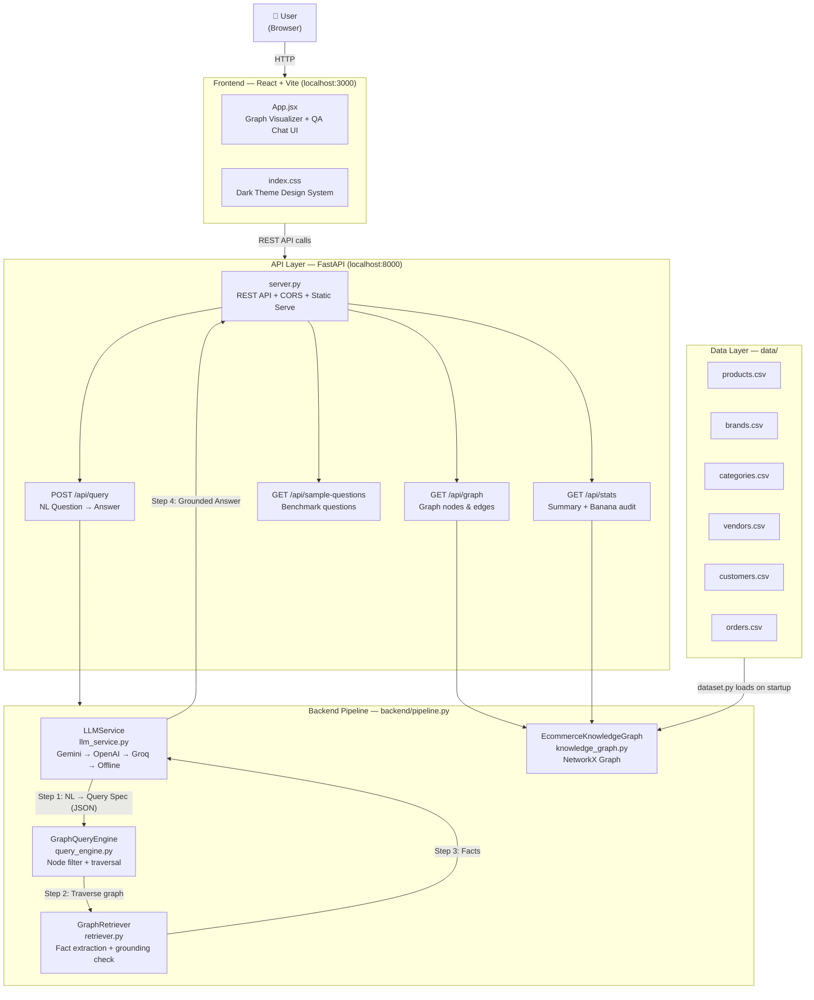
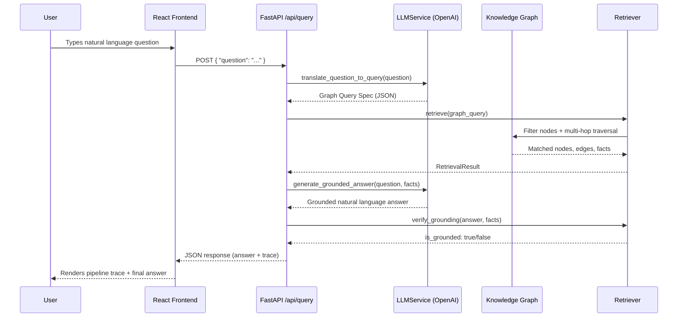
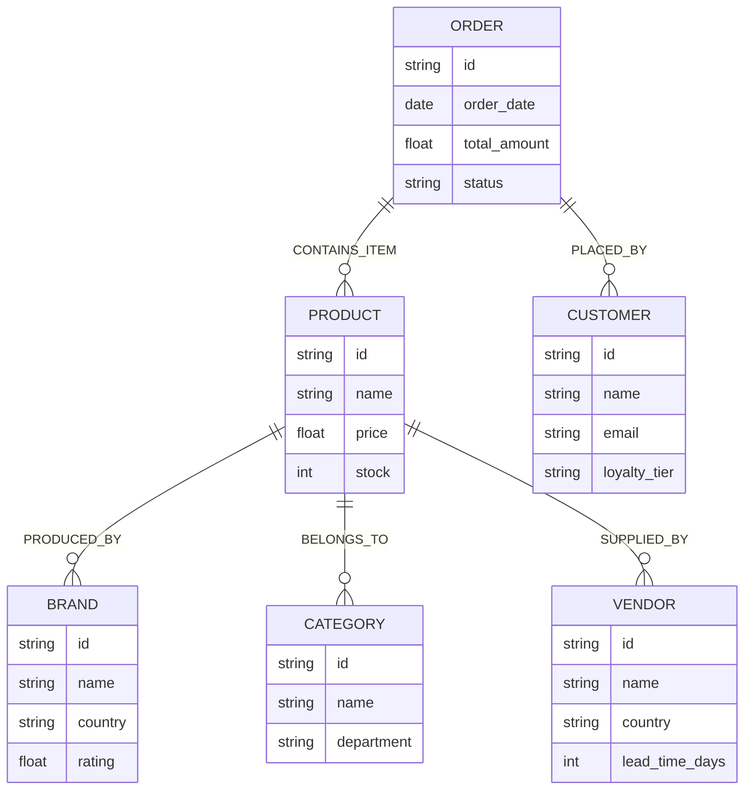

# 🏗️ Project Architecture — E-Commerce Knowledge Graph & AI Retrieval Engine

## Overview

A full-stack AI system that converts **natural language questions** into **structured graph queries**, traverses a **NetworkX knowledge graph**, and returns **strictly grounded answers** via an LLM.

---

## System Layers



---

## Query Pipeline (Step-by-Step)



---

## File Structure

| File | Role |
|---|---|
| [`server.py`](file:///c:/Users/bhagy/OneDrive/Desktop/AIProject/server.py) | FastAPI app, REST endpoints, CORS, static serving |
| [`main.py`](file:///c:/Users/bhagy/OneDrive/Desktop/AIProject/main.py) | CLI entry point, benchmark runner |
| [`backend/pipeline.py`](file:///c:/Users/bhagy/OneDrive/Desktop/AIProject/backend/pipeline.py) | Orchestrates full NL→Graph→Answer pipeline |
| [`backend/llm_service.py`](file:///c:/Users/bhagy/OneDrive/Desktop/AIProject/backend/llm_service.py) | LLM provider abstraction (Gemini/OpenAI/Groq/Offline) |
| [`backend/knowledge_graph.py`](file:///c:/Users/bhagy/OneDrive/Desktop/AIProject/backend/knowledge_graph.py) | NetworkX graph, entity CRUD, Banana audit |
| [`backend/query_engine.py`](file:///c:/Users/bhagy/OneDrive/Desktop/AIProject/backend/query_engine.py) | Query spec executor, node filtering, multi-hop traversal |
| [`backend/retriever.py`](file:///c:/Users/bhagy/OneDrive/Desktop/AIProject/backend/retriever.py) | Fact summarization, grounding verification |
| [`backend/dataset.py`](file:///c:/Users/bhagy/OneDrive/Desktop/AIProject/backend/dataset.py) | Sample data generator, CSV export |
| [`backend/models.py`](file:///c:/Users/bhagy/OneDrive/Desktop/AIProject/backend/models.py) | Pydantic data models (PipelineResponse, etc.) |
| [`frontend/src/App.jsx`](file:///c:/Users/bhagy/OneDrive/Desktop/AIProject/frontend/src/App.jsx) | React UI — graph canvas + QA chat interface |
| [`frontend/src/index.css`](file:///c:/Users/bhagy/OneDrive/Desktop/AIProject/frontend/src/index.css) | Dark-mode design system (CSS variables) |
| [`.env`](file:///c:/Users/bhagy/OneDrive/Desktop/AIProject/.env) | API keys (GEMINI, OPENAI, GROQ) |
| [`data/`](file:///c:/Users/bhagy/OneDrive/Desktop/AIProject/data) | CSV seed data (6 entity types) |

---

## Knowledge Graph Schema



---

## LLM Provider Fallback Chain

```
GEMINI_API_KEY set + valid ping  →  gemini
      ↓ (fails)
OPENAI_API_KEY set               →  openai   ← currently active
      ↓ (not set)
GROQ_API_KEY set                 →  groq
      ↓ (not set)
No keys                          →  offline_semantic_engine (deterministic rule-based)
```

---

## Graph Stats
| Metric | Value |
|---|---|
| Total Nodes | 40 |
| Total Edges | 100 |
| Entity Types | Product, Brand, Category, Vendor, Customer, Order |
| Special Requirement | Exactly **5** nodes named `"Banana"` (one per entity type except Order) |
